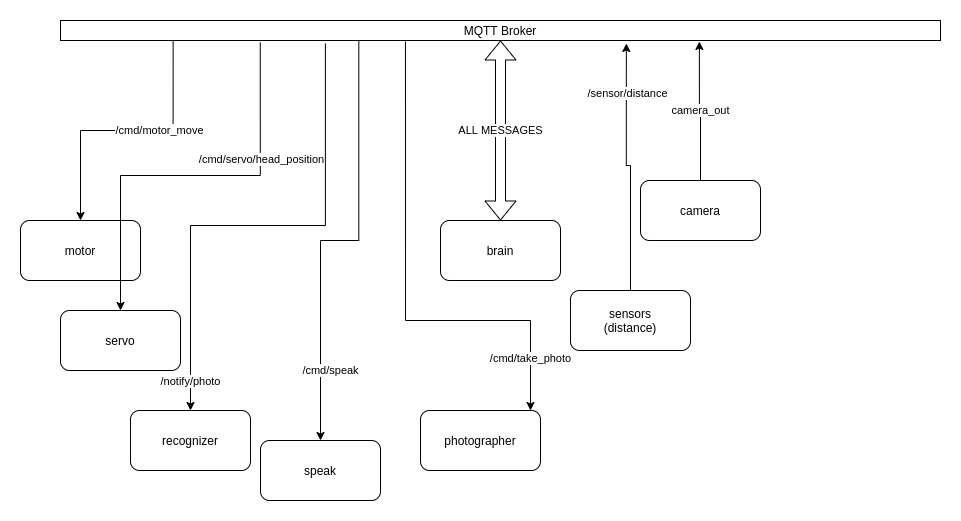

# Zamyotek
Zamyotek is Jetson-powered object detection robot, linked with Alexa and created in a decoupled manner. The idea of decoupling came from ROS that I haven't used as I wanted to have a purely Python solution.

## Demo
It moves, follows me and recognizes objects (somehow, we're still working to make it more reliable).

## Initial idea and change
The initial idea of the project was to follow objects and grab them with “arms” controlled by servo mechanisms. However, the custom trained Tensorflow detection algorithm based on SSD Mobilenet has pretty low performance with small sized objects. Thus, the idea was altered, and now Zamyotek will follow “big objects” (f.e. humans) and if presented with some object just ahead of him, he will speak what he sees.

## General idea
Zamyotek consists of *nodes* which are independently doing their job. They are publishing and subscribing to topics which are in the area of their responsibility. F.e. the node for sensor is sending distance measurements to `/sensor/distance` and *brain* node is listening to that and interpreting information to send commands to `/cmd/motor_move` where *motor* node is listening.
The main loop is reading data from the camera and sending coordinates of detected objects to MQTT queues. Some of these nodes are displayed in the diagram below.

## Hardware
The main *brain* of the robot is Jetson Nano SBC. It runs Ubuntu on board so it is easily extendable and one can install needed Linux packages easily. It means I can run Python nodes too. Jetson Nano is capable of connecting electronics on 40 PIN header, [check out docs](https://developer.nvidia.com/embedded/learn/jetson-nano-2gb-devkit-user-guide#id-.JetsonNano2GBDeveloperKitUserGuidevbatuu_v1.0-40-PinHeader(J6)). You can also connect additional accessories to it via USB ports. Microcontrollers are OK to connect any sensors compatible to the Voltage level. And in case of problems I feel much more comfortable to burn the microcontroller than Jetson Nano.  Thus in this project there are several ESPs which are connected via USB cable and transmit data via it. They take both input voltage and data via the same USB cable.
Major parts used in the project are shown in the diagram, however the connections are not displayed. This is just to give the general overview of the project.

## Machine Learning
Jetson Nano comes with many pretrained models which work very efficiently. However the author of this project wanted to train his custom model. Unfortunately SSD Mobilenet v2 has pretty low performance on small objects. So the initial idea was changed as explained in the first sections and now the default algorithms as part of Jetson Pack are used. It gives pretty good performance when TensorRT in real time with 30 FPS. Image recognition of objects put just ahead of it are done with AWS services, as mentioned in the AWS section.

## Cloud integration
To offload some ML calculations there were AWS services used to:
- recognize objects
- create speech fragments

Whenever an object is put in front of the robot, the photo is taken and according to the `TELLME` scenario it is sent to AWS Rekognition service. When object class is detected the sentence is put as a topic command to the node responsible for speech. As for the time of writing this docs Zamyotek does not have onboard speaker so it requires a device running the node and connected to the broker (I use my laptop to make it happen). Speech synthesis is done using AWS Polly service.

## Brain modes
The main software element of the robot is working in the following modes:
 - `FOLLOW`
 - `TELLME`

In the `FOLLOW` mode Zamyotek is just the trying to detect and move in the direction of object classes. The `TELLME` scenario is executed when objects are detected by distance sensor.

In the `TELLME` scenario Zamyotek is trying to tell you what he sees. As for now Internet communication is required because it uses 2 AWS services to accomplish that: Polly and Rekognition. In this scenario it moves camera down, takes a photo and sends to the recognition system. Then, if any “speaking node” is running it receives the command to play sound.

## Todo
Still there are some things I have in my head...
- replace NoIR with normal camera to get better quality colors
- add onboard speaker
- put some LEDs